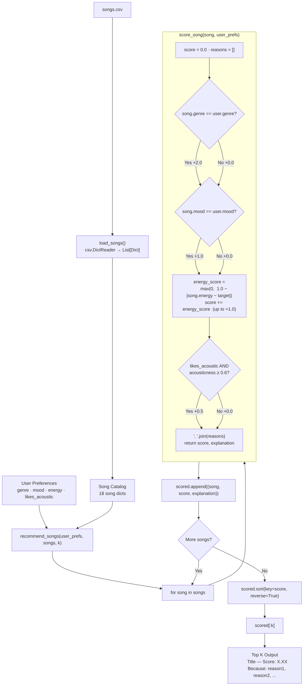

# Music Recommender — Data Flow

## Score breakdown

| Signal | Points | Formula |
|---|---|---|
| Genre match | +2.0 | exact string match |
| Mood match | +1.0 | exact string match |
| Energy similarity | up to +1.0 | `max(0, 1.0 − \|Δenergy\|)` |
| Acoustic bonus | +0.5 | `likes_acoustic=True` and `acousticness ≥ 0.6` |
| **Max possible** | **4.5** | |
